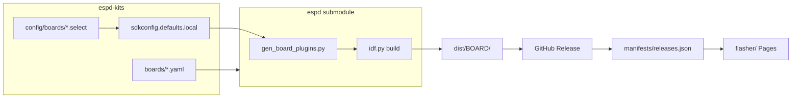

# Architecture — ESPD Kits

## Goals

1. **Single place** for board/plugin YAML presets (Waveshare, future kits, optional “profiles”).
2. **Reproducible binaries** per board × ESP-IDF target, published on GitHub Releases.
3. **Browser flashing** (GitHub Pages), aligned with [ESPD Web Flasher](https://flasher.michaelkramer.at/).

## Why a separate repo (vs only `espd`)

| Concern | `espd` (core) | `espd-kits` (this repo) |
|---------|---------------|-------------------------|
| Pd port, patches, dev sync | ✓ | submodule |
| Generic I2S + board *mechanism* | ✓ | — |
| Product/board *catalog* + releases | optional | ✓ |
| Web flasher + manifest | — | ✓ |
| Submodule pins (esp-bsp branches) | example YAML | versioned per kit |

**Submodule** pins firmware SHA per kits release. Board YAMLs live **here**; the **`espd` submodule is not modified** during builds.

## Managing board files

| File | Owner | Purpose |
|------|--------|---------|
| `boards/<id>.yaml` | **espd-kits** | Product catalog, CI matrix (`boards/index.yaml`) |
| `config/boards/<id>.select` | **espd-kits** | `CONFIG_ESPD_BOARD_*=y` for non-interactive builds |
| `boards/<id>.yaml` (optional) | **espd** | Same schema as **reference** for firmware-only clones |
| `components/espd_board_*` | **generated** | From YAML at CMake time; gitignored in espd |

**CI / local build** (ephemeral files under `espd/`, not committed in the submodule):

```bash
cp boards/waveshare_s3.yaml espd/boards/
cat config/boards/waveshare_s3.select > espd/sdkconfig.defaults.local
cd espd && idf.py set-target esp32s3 build
```

`build-board.sh` and `build.yml` do this automatically. Requires **espd** with `sdkconfig.defaults.local` in `CMakeLists.txt`.

## Build pipeline



1. `prepare_espd.sh` — Pd patches only.
2. `build-board.sh <id>` — writes `.local` + board YAML, `idf.py build` in `espd/`.
3. Tag release → `generate-manifest.py` → GitHub assets + `releases.json`.

## Manifest (flasher)

See `scripts/generate-manifest.py` and [flasher/INTEGRATION.md](../flasher/INTEGRATION.md).

## GitHub Actions

| Workflow | Trigger | Output |
|----------|---------|--------|
| `build.yml` | tags `v*`, manual | matrix from `boards/index.yaml`; release assets on tag |
| `pages.yml` | push to `main` | deploy `flasher/`; mirror release firmware via `sync-flasher-releases.py` |

## Follow-ups in `espd`

Done or tracked in upstream:

- Board-neutral `sdkconfig.defaults.esp32s3`
- `sdkconfig.defaults.local` (+ optional `ESPD_BOARDS_DIR` / `ESPD_SDKCONFIG_DEFAULTS` env)

## Release tagging

Tag **`vX.Y.Z`** on `espd-kits`, bump **`espd` submodule** to a commit that includes the hooks above, record both SHAs in release notes.
