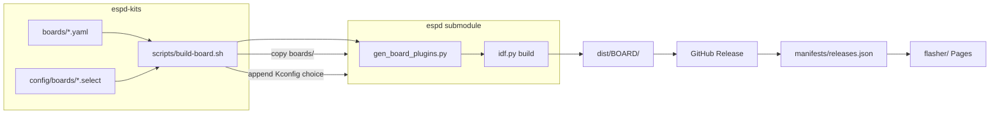

# Architecture — ESPD Kits

## Goals

1. **Single place** for board/plugin YAML presets (Waveshare, future kits, optional “profiles”).
2. **Reproducible binaries** per board × ESP-IDF target, published on GitHub Releases.
3. **Browser flashing** (GitHub Pages) without installing ESP-IDF, aligned with [ESPD Web Flasher](https://flasher.michaelkramer.at/).

## Why a separate repo (vs only `espd`)

| Concern | `espd` (core) | `espd-kits` (this repo) |
|---------|---------------|-------------------------|
| Pd port, patches, dev sync | ✓ | submodule |
| Generic I2S + board *mechanism* | ✓ | — |
| Product/board *catalog* + releases | optional | ✓ |
| Web flasher + manifest | — | ✓ |
| Submodule pins (esp-bsp branches) | example YAML | versioned per kit |

**Submodule** is the default: pin firmware SHA per kits release, fork-friendly, matches how `pd` is pinned inside `espd`.

**Alternatives** (not chosen for v1):

- **Monorepo** — simpler CI, but couples flasher churn to firmware PRs.
- **Git subtree** — fewer clone steps, harder pin/upgrade story.
- **espd as npm/idf component only** — doesn’t own `boards/*.yaml` generation today.

## Build pipeline



1. `prepare_espd.sh` — init submodule, `apply-pd-patches.sh`, sync `boards/*.yaml` → `espd/boards/`.
2. `build-board.sh <id>` — read `target` from YAML; append `config/boards/<id>.select` to `espd/sdkconfig.defaults.<target>` **in the build tree only** (CI workspace; not committed into `espd`).
3. `idf.py set-target` + `build` inside `espd/`.
4. Copy `espd.bin`, `bootloader.bin`, `partition-table.bin`, `flash_args` → `dist/<id>/`.
5. Optional: `esptool.py merge_bin` → single `espd-merged.bin` for flasher offset `0x0`.

Board plugins are still generated by **`espd/scripts/gen_board_plugins.py`** on CMake configure — YAML source of truth remains in **this** repo.

## Manifest (flasher)

`scripts/generate-manifest.py` writes `manifests/releases.json`:

```json
{
  "version": "0.1.0",
  "boards": [
    {
      "id": "waveshare_s3",
      "name": "Waveshare ESP32-S3-AUDIO",
      "target": "esp32s3",
      "files": {
        "bootloader": { "url": "…/bootloader.bin", "offset": "0x0" },
        "partition_table": { "url": "…/partition-table.bin", "offset": "0x8000" },
        "app": { "url": "…/espd.bin", "offset": "0x10000" }
      }
    }
  ]
}
```

Offsets follow `espd/build/flash_args`. The flasher can also offer a **merged** image when present.

## GitHub Actions

| Workflow | Trigger | Output |
|----------|---------|--------|
| `build.yml` | push `main`, tags `v*` | matrix over `boards/index.yaml`; artifacts; release upload on tag |
| `pages.yml` | push `main`, tags | deploy `flasher/` + generated manifest |

## Presets (optional)

`presets/<name>/` can ship example `config.txt` + minimal `main.pd` for workshops — synced with `espd_sync.py`, not baked into firmware. Keeps “configuration bundles” separate from BSP YAML.

## Follow-ups in `espd` (small, recommended)

1. Remove **`CONFIG_ESPD_BOARD_WAVESHARE_S3=y`** from `sdkconfig.defaults.esp32s3` so chip defaults stay board-neutral; kits repo owns board selection.
2. Optional CMake: load `sdkconfig.defaults.espd-kits` if present (or `ESPD_SDKCONFIG_DEFAULTS` env) so CI need not append into `sdkconfig.defaults.esp32s3`.
3. Optional: `gen_board_plugins.py --boards-dir` for a path outside `espd/boards/` (avoid copy step).

## Flasher code reuse

The UI at [flasher.michaelkramer.at](https://flasher.michaelkramer.at/) can be vendored later (submodule or copy) into `flasher/` once license/repo is confirmed. v1 scaffold uses a minimal loader + manifest contract documented above.

## Release tagging

- Tag **`vX.Y.Z`** on `espd-kits`.
- Record **`espd` submodule commit** in release notes.
- `releases.json` `version` matches tag; asset URLs use that tag path.
